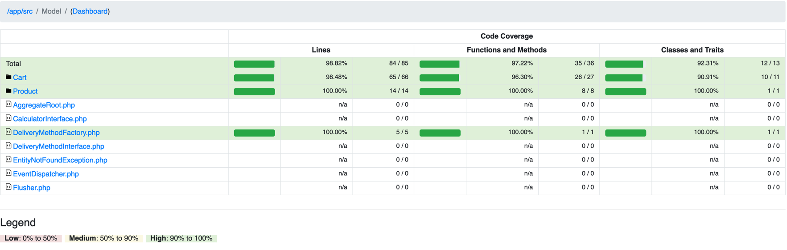

# acme-cart

## How to run

1. Make sure you have docker and docker-compose installed and run.
2. Run `make init` in order to build and start an application.
3. Now API could be accessed on http://localhost:8080.

## Conditions

### Product samples

| Product      | Code | Price  |
|--------------|------|--------|
| Red Widget   | R01  | $32.95 |
| Green Widget | G01  | $24.95 |
| Blue Widget  | B01  | $7.95  |

### Delivery costs

| Order cost  | Delivery cost |
|-------------|---------------|
| under $50   | $4.95         |
| under $90   | $2.95         |
| $90 or more | $0            |

### Special offers

`Buy one red widget, get the second half price`.

### Cart samples

| Products                | Cart Id                              | Total  |
|-------------------------|--------------------------------------|--------|
| B01, G01                | 7d527665-735e-420c-9ab7-4ee0402df7e7 | $37.85 |
| R01, R01                | c6a98462-c580-40b5-b90c-b99920f2b344 | $54.37 |
| R01, G01                | 97c69798-8389-4b55-a291-01465c014df8 | $60.85 |
| B01, B01, R01, R01, R01 | 660a88c5-3626-4f51-bb6f-2c63d941a494 | $98.27 |


## Application design

I was keeping in mind that this application could grow and a need to help less experienced developers write good code.
This being said, the application design was built around DDD and CQRS approached:
- [Infrastructure](src%2FInfrastructure) layer (as well as [Controller](src%2FController)) was set aside core layers.
Here we have Repos and Fetchers realisation, Events, Http and some shared DataTypes.
- Then we have [Write](src%2FModel) and [Read](src%2FReadModel) models to support working with UseCases and querying respectively.
Also, this approach works well for potential future growth if we decide to separate application or add Event sourcing.
- [Model](src%2FModel) includes several different contexts: [Cart](src%2FModel%2FCart) - our main target and
[Product](src%2FModel%2FProduct) - as an additional example of how to define boundaries and add new contexts in the future.
- Inside every context we have:
  - [Application](src%2FModel%2FCart%2FApplication) layer with our Use Cases:
    - `Command` class - stores all values from the `Interface Adapters` layer (Controller in our app atm).
    - `Handler` class - service with `handle` method to take care of `Command`.
  - [Domain](src%2FModel%2FCart%2FDomain) layer with entities, needed interfaces and auxiliary services.
- There 2 main aggregates in the application atm: [Cart.php](src%2FModel%2FCart%2FDomain%2FEntity%2FCart%2FCart.php) and 
[Product.php](src%2FModel%2FProduct%2FDomain%2FEntity%2FProduct%2FProduct.php). They are separated as have different
responsibilities and clear boundary. Keeping aggregates clean helps a lot in the application maintenance long-term.

## Testing

- To make all checks (tests, phpcs, phpstan) run `make check`.
- In order to run only phpstan run `make phpstan`.
- In order to run only phpcs run `make phpcs`.
- In order to run only all tests run `make test`.
- In order to run only unit tests run `make test-unit`.
- To use more complex command you can just get inside container `make sh c=acme-cart-php-fpm` and do your stuff.

### Test coverage

- To see test coverage run `make test-unit-coverage` and then open `var/coverage/index.html`

For now all needed business logic is covered:


### Some tests could be done through API as well

`id` could be grabbed from [Cart samples](#cart-samples):
```curl
curl --location --request POST 'http://127.0.0.1:8080/calculate?id=7d527665-735e-420c-9ab7-4ee0402df7e7'
```

### Logs

Logs can be obtained from `/var/log/error.log`.

Monolog log handler was added to `index.php` for a test purpose to cover all exceptions.
Log coverage inside application code could be achieved with injecting `LoggerInterface`.

## Notes

- [Http](src%2FInfrastructure%2FHttp) layer was build in primitive and easy way just for test purpose.
- Some of the application parts could be seen as a redundant or not completed - this is done to show application grow potential and 
point future enlargement.
- Event system was implemented for future usage and keeping code clean. 
In order to use it you need to implement `App\Model\AggregateRoot` interface inside your `Aggregate` and just add needed entities while calling `App\Model\Flusher::flush()`.
As an example `App\Model\Product\Domain\Entity\Event\ProductOutOfStock` was added to [Product.php](src%2FModel%2FProduct%2FDomain%2FEntity%2FProduct%2FProduct.php) aggregate.
Also, an example of EventDispatcher was added as `App\Infrastructure\Event\Dispatcher\MessengerEventDispatcher`.
- `Cart` and `Product` could be extended with a `Status` object-value and `State machine` pattern to make switching even more convenient and safe (tho it should be mainly on an `Order` aggregate side that is not implemented here yet).
- Delivery costs should be added on checkout step when `Order` is in process of set up, but as we are working only around a basket,
[DeliveryMethod](src%2FModel%2FDeliveryMethodFactory.php) was added as a `Strategy`.
- Total cart cost is calculated with a help on [Calculator](src%2FModel%2FCart%2FDomain%2FService%2FCalculator) that 
is built upon `Composit` - by including Cost services inside each other - we can achieve a really flexible way
to handle all current and potential discounts, special offers, promotions etc.
- The 3rd party Dependency injection container was not added to keep this application as clean as possible.
Thus, all dependencies were resolved by hands. Still in the future it could be easily replaced by any DIC realization as
code was written using Dependency inversion principle.
- `webmozart/assert` was added to wrap identical validation code.
A little trade-off between keeping `Enterprise Business Rules` (Entity) layer as much independent as possible and writing lots of
additional (sometimes duplicated) code. Could be replaced by fully implemented validation.


## Troubleshooting

- If you have an error 
```
xcrun: error: invalid active developer path (/Library/Developer/CommandLineTools), missing xcrun at: /Library/Developer/CommandLineTools/usr/bin/xcrun
```
while running `make` command - you [need to install](https://apple.stackexchange.com/questions/254380/why-am-i-getting-an-invalid-active-developer-path-when-attempting-to-use-git-a) the `Xcode Command Line Tools` (run `xcode-select --install`) or reset it if has been already done (run `xcode-select --reset`).